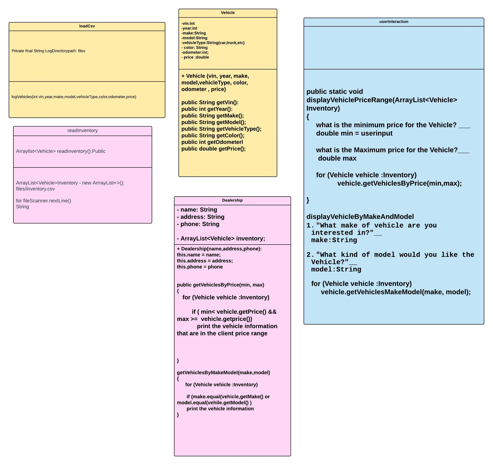
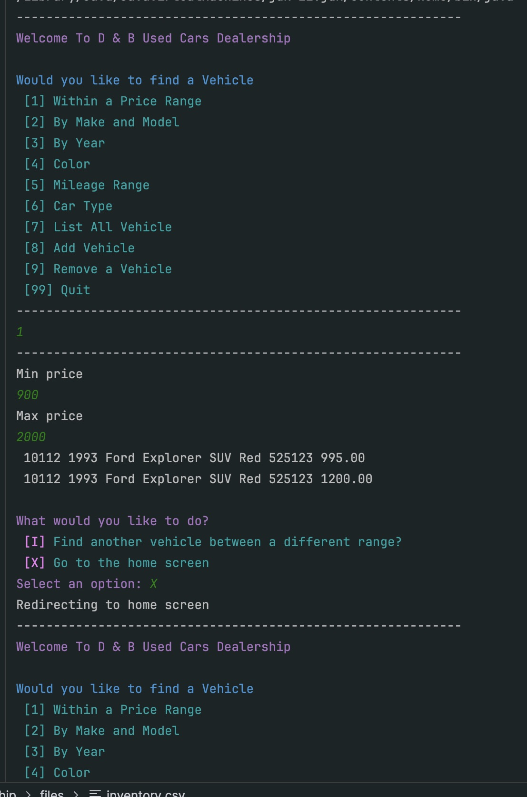
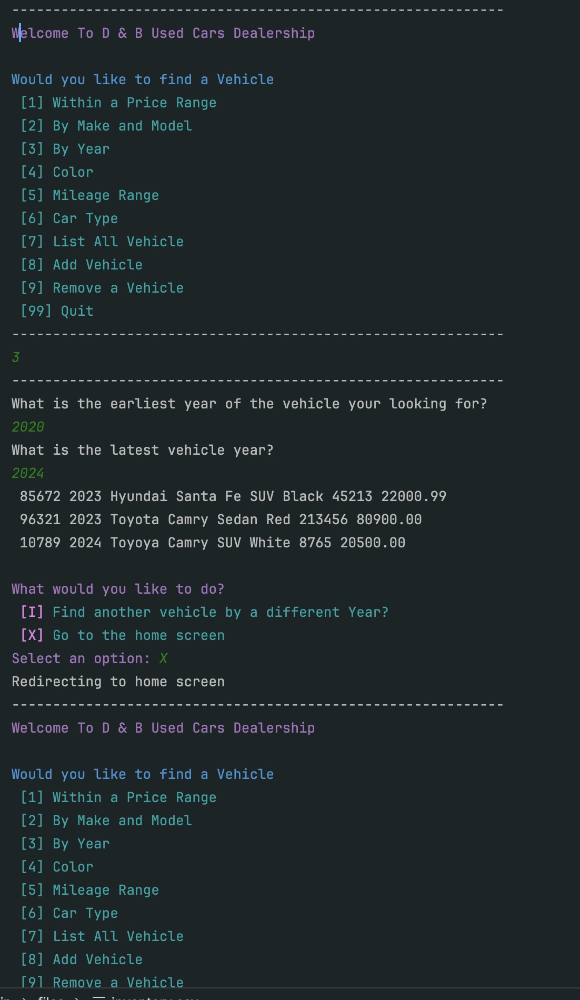
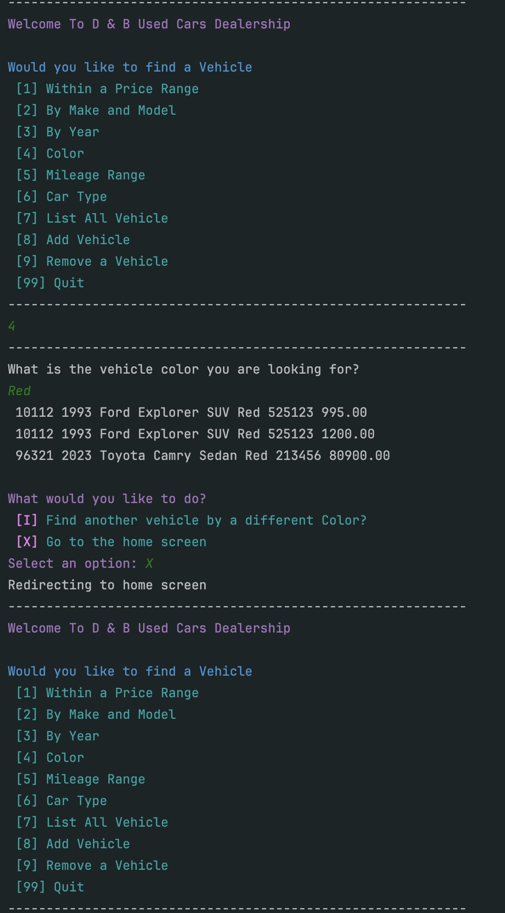
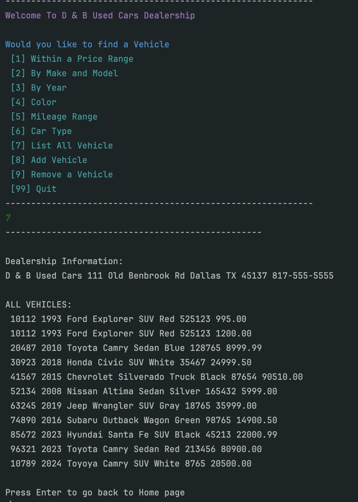
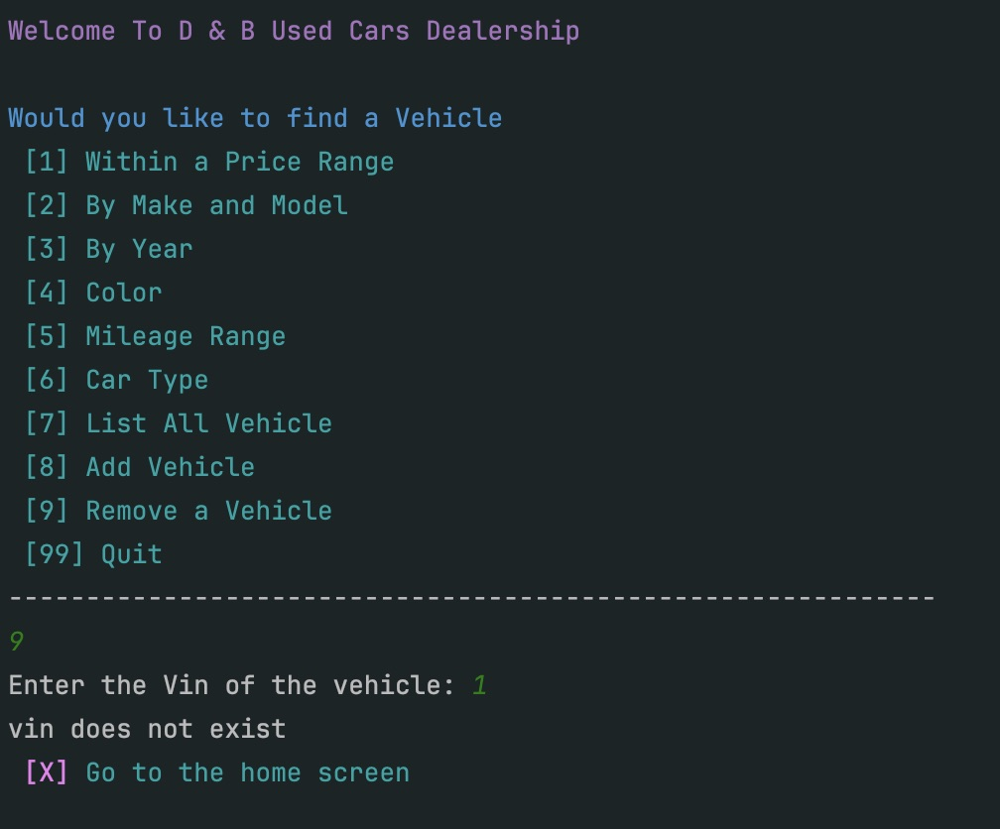

# Dealership

The Car Dealership program is designed to help the sales process for a salesman or sales manager. This application allows finding the right vehicle for the client's desired car and features. This application lets you easily manage the vehicle inventory and assist customers in finding their dream car.

## Process

Although I had the information I needed for each one of my classes, I wanted to understand where I was going to place my ArrayList. Although I had an idea, I learned in the UserInteraction class that I can just call the Dealership dealer and load the data from there, getting all the information about the vehicles in the dealership inventory.

##Demo 

